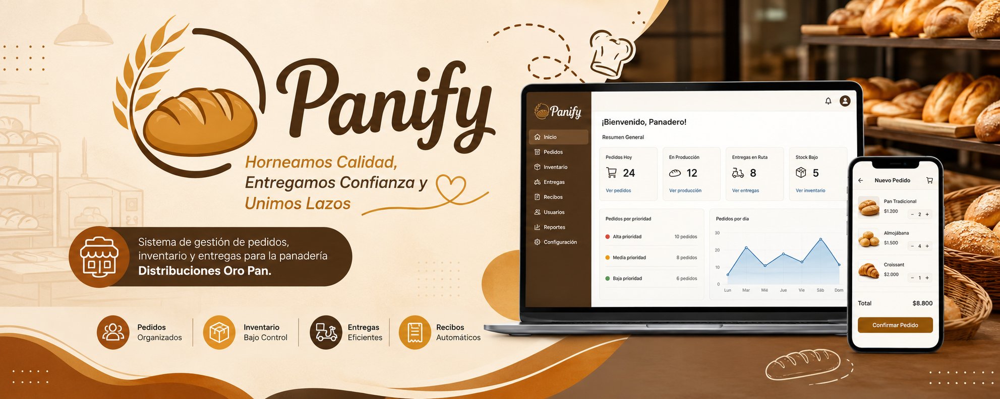

<div align="center">


# Panify

### _"Horneamos Calidad, Entregamos Confianza y Unimos Lazos"_

Sistema de gestión de pedidos, inventario y entregas para la panadería **Distribuciones Oro Pan**.


![SENA](https://img.shields.io/badge/ADSO-white?style=flat&logo=data%3Aimage%2Fx-icon%3Bbase64%2CAAABAAEAAAAAAAEAIAAaIQAAFgAAAIlQTkcNChoKAAAADUlIRFIAAAEAAAABAAgGAAAAXHKoZgAAAAFvck5UAc%2Bid5oAACDUSURBVHja7V1nuBXV2aU3wYIEUFEwdpDYrhobKNHYSNQYG36WNEvUeNQYO1E0GjUaW2xoLMTyBbsY%2BVCC5VNUAtZgTVQkiEGBK6ICAtnv45on43juvefMvO%2BePXPXep71%2BEPuOXNm9rtm77e2aUMQBEEQBEEQBEGUFZUHBtdEgiDKbextHTs5dnXs5tjZsT1FgSDKZ%2FQdHddy%2FI7j0Y4XO45xfMDxEceJjuMc73S8wvFEx%2BGO60McKAYEUTDDl7f5Bo5HOd7l%2BJbjQsflNXKR40zHCY6nO27p2IVCQBBhG79s5XdyvMFxhuOyOoy%2BOX7oeJ%2Fj%2Fo4rUQgIIizDlzP9No63Oc5XMvqmdgZyZNgnuSMgCCIf4%2B%2FjeK7jB4aGn6QcJ251HMjdAEHkZ%2Fzy1n%2FMo%2BEn%2BbrjgckIAkEQtsYvW%2F6DHN%2FN0fgjfux4VjJiQBCEjfHL2%2FZYx3kBGH%2FEJY5XOa5IESAIO%2BNv53ic44KAjD%2BiRByuduxBASAImzP%2FIY6NARp%2FxKWOFyLLkCJAEIoCMBTJOcsD52fIOORRgCCUjL%2Bf4%2BQCGH%2FEWY47UAAIIrvxd3C8rEDGH1EShlalCBBENgH4bmAe%2F3qcgr%2BkABBEeuPv7vhQAY0%2F4puO61EECCKdAEjO%2FacFFgDhKAoAQdQvAFJsc3%2FBjT9KFx5AESCI%2Bt7%2Bkuc%2FtwQCIL6AIykABFGfAJxTAuOPOC4qHyYIomUBkJz6J0skAO87DuIugCBqE4DN0IWnLAIgKcKHUQAIorbt%2F6EwmuUl4pUUAIKoTQAuLJnxCx%2BNegYQBNG0AEjq79gSCsCrjqtRAAiieQFYoWQOwLgjcCAFgCCaF4Beji%2BWUAAaMV%2BAD5ogmhGANZA9VzYBkE7CO1IACKJ5AVgLk3zKJgDSKGRnCgBBNC8AfR2nl1AAPnHcjgJAEM0LwMqOU0soAFLXsDkFgCCaF4CumNpbNgGQWYXrUAAIonkBkKEfN5VQAKY59qQAEETzAiA8tYQCcLdjRwoAQbQsAns6fl4yARjJWgCCqE0A1nb8Z8lCgLtTAAiiNgGQrfJdJasDWIMCQBC1%2BwF%2BUqKS4Gvh3OQDJogaBWAA2mqXIQFoV779CaJ%2BEbi4BALwSDQxmCCI%2BgRgk4IMBG2KixxH8O1PEOlEoG3BuwONR4NTCgBBpNwFSEjwpYLm%2Fu9C4yeI7CIwAvX0RRKAixzbUwAIIrsAdHK8omCjwfvQ%2BAlCTwTEoB4ugPG%2F4bgFjZ8gdAVAuKHjswEbv0Qs9ohfM0EQuiLwLcfnAjT%2BfznuTeMnCHsR2Njx8YCMX3oYDqfxE4Q%2FEZDmoX9y%2FCJn45cZBlvT%2BAnCvwh0dzzJcVZOOf5%2FcOxH4yeI%2FESgDd7AUj78qadJv0857hN1%2BKHxE0T%2BQiCDN%2FdF%2Bu0nBoa%2FxPFvjsc6fiMpQgRBhLEb6I7y29Fwzi3JYPTLcLy4x%2FFgx940fIIohhC0Q0%2BB%2FRwvc5yENmPzUaW3NGHoix0XOL7n%2BIzjjWhKMsixMw2fIIopBPGpw%2F0xoHM43ug%2FczzS8VDE8GVyz7qOK0UdfGj4BFFOQaiJBEEQBEEQBEEQBEEQBEEQBNE8snqi6bkmiHIZfRfHVVDRNtCxwXEomkju5fiDBL%2BH%2F7cDus1shCKUldEuS1UMfAuWpfAVQWyLIv58YaW7QT1gsGLYv0KK6njMi%2F%2BH42zHRjS9%2FAxZaosTXIT%2FtxCZbLOQ5jrF8UHHqxx%2F4fhddNHNlLmGv1kZgrNjwNzJcavmxm7jt0hiz%2BYQzyS3SfGdW8YLgZTWTXt0PGpo4jpbYk9LY4qtpfaxl9YWKdkAmyhH09QqRi8L7juOF6BxxSwYsXWlmlTDvQ1ROBGNM9rXKwT4t2L8%2F8ZnLgyUIopTHVdtQQC%2Bi9%2FSWIUL6vxOuR8fOh6t9RaLvSgeQSFTY52ci5RnH%2Bt7D7Q%2B%2BzjFdUaUv51RirbpiZvTGwvjCaOKtDRtqm7AW7LmHQH%2BzY6B%2FIaWON2xVwsCsIeBAIvRHaQhAvh7GSAyOUOJ8sEeBGAt5XZsj8cLrIps%2FO1wTn8q0Im27zuegnz4WgVgaEEE4O81CsDnBt89S6MJaEwAnk55HV9EI8gM13hHHDU1758UYZ0dr7soovHLeftUnM1DNhRZJFeiXLbZm00BqIv%2FwHEptQiEKgCJXeOBRuthDvwqxRGA2E0R5TrZ0%2FleSwROoQCoU0aXbZbR6RqyAGyA%2B2x1%2FybFm6wUSQCGQsE0psjOgFf%2FUQzAiDgJjq53lcZjzUCNe0uhMwpAfRTjXT%2BNCIQoALHf0dVxjPG9K9ZRABfZwfFWBcO%2FC7H%2BdZEb0AXnrYjdEOKR8N7Ojuc7vp7xe08ukQC8GogACCekaRIamgAktv5HedrhfuA4pBD5AbjAAegwk%2BVH3wADrzd5Yj3HcRm%2BdywEzFIAxFt8hjHPQkOPboEIQHRve9WzkAMWAMmdeMejmD8ShXSLIADbI4ac5QcfnSI8F3EbxFTTfO%2BzyFWwFIBrA8oE9CkAkbCvWEQBSOSyPJDiWmZn8Bcsg7CHvQvAxe2KRJQsC%2BUxOFjSpLbKghnpeDX609fKy5A1uIKxAFwXwkPMSQAkFHwJjnO1CnvuApBYf6ekGLoiBnwabGNeyt8yOx5VCVkAts7wBo7zNZzrh%2BH82CWQtyYFIBslhfvM6KhVQ9QlJAEYAkOs9zqegDdf8mKuyehL6RmsCODC%2Bik445KTZt5AncCVeEtLctEmjn3hjfVSVKEkALeEUP2oIACNcFCl%2BVuJ2hzXknc7BAFIZLNOSnEN8xNJUQORI5F2B3VKsEeBWPbfDcZvkUUIM06HKl6LUVjfx5TcbySn0yhWA2YVgPsc13Rc3YBrYKG28yAAL6M9%2BOyUfy9b4UOaeyZ5C0Aio%2FX8lNdwZXy3A56UITNWsiy3DVkA2qCN9AcV%2F6GvxRCGl2BoFyAXvAEe6EwtrZUEoBHHGwvKTumh5sJ%2FygIgQvujDE7f2RDtqs8iTwFIrJHhKc%2Fu4vRbp8qa64VjQdo19DBC42GJQCIT8HhPM%2Blq2TZJgcrzjn90PBzhwvb1CkFB8gBew9HIWgBegQDIsz4d4pvmc96Jp7zGrzsQAeiP0Wf1fvfnWGtN7UL3zrCOwj0KJIokjlfKCNQWBFl0N8Er27XOc3PoAjDdowD0jmXFXQ5vd9qsxYbkc8hLAGLX0QnRpDTf%2Fed4LksTtTJZEub%2BFR%2B%2FHnJNwM5IZFgcoLHI1vVueHfbeooClFEA2mBLekfGBKmNqrwpvQpA4rsPTplm%2Fl5c0FpIKJqZ4Z49GOWthCwCURedg3E%2B%2FTBAoxF%2FxQnxjkEUgLoFIIoAPZrh2idiyx2CAGyEdOo0STun1eDcjPjrjEVsJ4UeFUgWUEjro19Cvd4NqGJwEc6y7Vt4cBSApgWgDQqqns9w%2FfcmPtebACRGqt%2BWoYKvV405Dm0Qvflbhvs1M9ijQDNCEJ2B1kFMfySKf15Ei6q8RKERzpkiC8AbvgWgyjPeIWM9yC2xra0XAUhc%2F89TrsG5aLNWb87GiIzZs%2BEeBWoUg6iKULzKgxEaOgEOmIcRcpqtkGJca9bWKoYC8CbyFq424LUQ0xV9C0CVZ7s3xDxt7vvl2DF29ywADdiZpvm%2BG%2FH2X7kF9orlbqyGqNTEjEeB43M9ChhmtHWGMAyEuh7heJHjPY4vYJEtURQAEZndm4lLZxWA25vKRyhYJuDXBKDKOjgiw71aglr4nmgpZyYACV%2FVuAyi9TaOPy%2B0wJcT%2BRuvKkTLZuB4nasAdECK7raoyquH26L2v9YF3hFKOhidXy9DOGmZggicbSgAd0R%2BhoLXAlQVgIRBdcCOJK1Afwon2XNWApBYU6cH2ruynizTHrmIQExBn07ZwlnCLb%2Bvw3lSjf2wdcy6IxgdvaUpAPULQOI5dc3YNHNhhvtdjwDslOHIEgqX5HYUqPy3h%2FvTGX7An%2Bptf1RFBFbDtirLjbyeO4BsApB4Nj2RGJNHr8cRNYhU34ypuSHx3XgfxjyOAGMznmO2quc8W%2BXfrp%2FBiRPxdB8CkGd5s2cBiHrnTwpFACpfnehzUUmMP%2BJdlRq6XFs5AU%2FNePESCjwgXuxQI9vDH3BXxu%2BX6Sw7UgCyC0AVERiM55urAFSJVjSWTAAk6%2FYYr0eBRBglq0dTPPEyDeZ3KKgYBg%2FnhgiZrIeOQZsh1fgYJG7MVLh59zfVFUhJAN7CEeM6Y45GG6lueQpAFYMb6rGfXksCsHbGpKWQKRGJTfMQgI5Y4JqtkcUb%2FBFqoWeCs5BWrFlx%2BB5KmYucCBTnC5UmhmP6FIAqIrCvp5TwrwlAIrycZZ1KU49n0EdSm89AmLImxI31ehSI3VwJ500tmGK%2Bj6NHmxIJwNQWkpq8CUAVETi6ojPPoWYBSHz%2FYRleHjMQuu6BDDwL9sFuNOtR4Mi8jgLfrnw56rsIhjIlmcJZ4GKgYAWgSo7A2cpJXLUKwMZImU77uWd48t0MQ3rx8oxHzsF5CEDkkR%2FjQemznJPOrdQ4tIICkF0AqhTdXONDAGLsnjFSNTmqtajYTx3uoHScvrNabwJfItAFBT%2F3BNIc5GPkKpxaqdJ6vAQNQYIXgMQaWRU9GXwJQCXDrkNeZD%2F0YUix690ER46sla5HeE8QqpLTvwXql0UMXocxLjN%2BA8xHYtD9iO8PqRZirOP37BjwjibJaTUIwKI8BCCxPgYYJeIsRR%2BK6Hu2RSedtJ83pqWeEUa2M0rhXryFo08uCULV8vhl2709wnzyA2%2BufNn6%2B1kUR7yNhzUb56Ak58BxNwM%2F7iUsovtQFSfGfhBqpVdHe6dMHYIr%2F214OhNNIucGTIltP4b07KZ%2Byy64v%2FNSfPbTlRqaj9axNjZFXfx8xXvwYeyNvQpeAovg%2FKuHn2GNec2wS%2FQlnIbd2qcp%2BTlCw11CrRZsi4tbCW%2BW%2Ftiib4ydQ5wN2BoNRMRhDWwle1RaaAdeyd4WvAcWQkOV6wqJDehq06EZAVgJbakaUnz2oEozcxRTrov%2BBve1Z%2By5bYcd4A51cggcae1yEoA2yIFJc%2B3x37B1bgLguYTYcjBIIWn5W1rbfS2DjRAEQRAEQRAEQRAEQRAEQRAE0WpR5JAXybAomXF9xBo6rk6Whp0MBKATGqh0w3%2BrsStSaMlw2bGaAOyBVtuvkYXmG0iR7m0gAJJd91f07m%2BKEzHghQyTE1AV2zEpAAcaF%2BuQfijP8DijI8BKqOHgfS42J0SFTvGHewAq6niDis2%2FxnLiLXwAO6OgiPe6uHyYAlBOLkA%2FBvUc8ETjiut4r8snAPsbt2wi7XlLvBTaMFo0WGEeAxmYAOxZyW9UN5mdM1Hu66N9lfBM3vNyCcDuGVpGkflzlI8S0Nh3rFHAbtAkBaCUlJkAa%2Fqq%2F0602%2BaukQJA5kjpB%2F%2FjnLrXSOedh%2FgMKABkfhQDXNF39xeGBSkAZP6cBwPMs30Vw4IUADInXhs168yj9xvDghQAMt9JR4PybPzIsGC5BGA3CkCh8v1PDaHrayIsOI3PprgCMKSiO36btKMMVOlbCaTtc0wEfoSoBJ9RAQVAJvcs5M0JnjK55qCQer7HBECiEX%2FhM6IAkHa8u%2BJz%2Bmv9IiCj1%2BfzOVEASH3OwXMKbuJL5auzIEfzWRVPAKTbi0zwXYqy4C%2FgFMxK2bJ%2BosAFeLPMy8iPKl8OGp1VJz8I4Hx7aUVpZl3FduzXJjmHBWUI6t8TlG5J%2F1TgjJTrJ8k5CmtZ2FinHYk93ltNAGT6677oCyDcz3F45ctWYVko0YWhlfSDDiNuh2q3TTNwMyzODVNwEO7J2Jx2SrKA11M2%2Fq6azsSEoIzMqSbieOQl9ElQ%2BiT2V%2BA6KddPkhtjPW6akVtX6h8cunH0ImHH1%2FopE1cPx1vG18KWXdkvDAxVhP425PRrf3Y%2Fz2FBEeYBXJ8cHOqrdfrRHivhHq98ORJd8%2B0vb8XJOOodbrQL8BUWfBaCw4VNeBOClR2f9LC45dy2l8G5%2F1eV%2FzaBfRHbW20R8BEWlN3RETR%2BIg8RGOVBAP4UOWwUBWAQHFrx7%2FmtY1sDEbAOC4pDbSMaP5GHABxasW2lLot7S2Xj74AiouR3SZRjWwMBsA4LvhQdjwjCtwD8wPiM%2BxutrW3sc3Zppn5fkoxWKFhYcHLkxCQI3wJwEM6gVm%2B2%2FsrGvyKSQJr6zs%2Bxq2lj4HMYaRj6W4VHAMK38VuWwEp79p9qGGLien9aw47l%2BbhHXfF%2BWYUFZyGuTQEgvArAN5FhZiEA%2F1f5cgyX5lu4P3YVtXz%2FuUa7AKuwoFqGJEHUspjbwmtuYfziMd9V2fjkes%2Bv4xok1fXbBQoLzkGWGwWA8CIAW8FILARgdCU5vjn79W6d4nrHalYdeggL3qPpwCSIphZwZ6TPWhj%2FO8hj1zR%2BSV2%2BPe%2B%2BAx7CgnK9IygAhLUA7IXsPAsBOMPg7L1vhuKlKWj1VZSwoKQEr0YRIKyMX8ZuTzIy%2Filaizd2vd9w%2FP%2BM13WOkUPw10b38TSmBRMWxi88pmIzQl3i7wcbGNkvFfIU%2FuXYYLALWBMx%2FGCPUQThK%2Bx3n5YDK3a9kh%2F%2FD6Xrux2%2BBG0R%2BIlRWPB6LUcqQeO3Dvt9iIYp2vn%2BVyteo3SL3t9AACTXYXzIoVSCAmAd9rvcsb2yAFjM61N1sMWudTe0tdK%2Br%2BO1kqmI1m38lmG%2FNx03UDZ%2By4m9Zxo4BGWrfqPBtcrR4mcUACLrArUK%2B4lz7gSDN%2BqPDSsU30NfRu1r3hSfHWxBFdE6jd8y7PckGrFqvk3XQncf6wYlXQwiFmdbl1QTRL0L0yrstxC9BLSN6DwPHYoWIrmoKGHB97WaqhCty%2Fgtw353GLxFt0RprI8mpU%2BhqWhRwoK3aYYxifIbv2XY730U52jn%2B9%2Fmyfij6cSnGVULjjfatexDASBqXYiWYb8LtJpvJlqT%2BR5W8i6cd0UJCz6h5XMhym38lmG%2FV%2BLDK5Sut5dCvn9a3uzYqSBhQYm6VFgnQLS0AK3CftLm6yiDNl8nGvYlbIkL4jMLFEXAKiz4huP6FACiqYVnGfZ7BMNENA1lQyQT5Tmw9ElUHWofBazCgpexfRjR1NvUKuzXiEGpmsYv6cNXBTBqehmmDGnvAqzCgh9iQCYFgPAW9vujQZuvYY5zA5k3%2F7ZmZ14PYUG16kuiHMZvGfaboeUtT%2BT7jwvE%2BCPeYCByVtWCav0XiHIIgGXYb6TBm9HX1N16%2BLHj9woUFlTrwEQU2%2Fgtw35TtXrqJc7Gzwdm%2FBEfMxhjbhUWVK1uJIorAFZhv0XxMVuKjspRgRr%2F1yocCxAWlGSmb1EAWq%2FxW4b9HnTsrmwIDejRtzxgShuygQbCd07ovguieAJgFfYT7%2FxOykYgR5UxgRu%2Fek8%2BD6XOjfAzUABamfFbhv2uMmjztbfhPIKgjSp2D36GjErt652glaRFFMP4LcN%2Bb6Ejr3a%2B%2FxMFMf6IE3HE0g4LTjBK0z6SAtB6BMAq7CdZcScb5PufkGO%2Bf1rK0ep4A4fg7gg5al%2Fvy1qFWkTYxt8Zba0sFv3Tjr2VF%2FwGAeT7Z2l6uqFBWPCm0Eu1iXAF4HuoYtNePNI7fz%2BDfP8rCmr8Ef%2BAOQWa92Uzx5lGzVq2ogCU1%2FhXcfyr0UL%2Fs2NX5YW%2Bo%2BNHBReAeRgJXpR8CLV2bURYxi882ijs94HjNsqLXHIIHjA2zk9RHWcdXbAohbYKC6o1bCXCEoC10ZHHYoFfbNDm6zBkE1pc76uO5zruglHdO6CxyNNGzkYR3Z8bOAStwoKqPQ6IMN7%2B5xsZ03TkFGgu7H6O04ym5UiSzjqJexMPN55u5GV%2FzXG9goQFl0IQWSdQEgGwapmt9mbzlPZ6V7wOvgm2w7xCi%2B%2B%2FwiBByiosqDa2jcg%2F7DfGMNllFeUFvbmRh3t23E%2BRvN6ECMib%2BnWjFOnvFCgsqCZYRPnCfvKZw5UXs3TYvcVoMf%2B2Fj9F7FqOM3KY%2FgX9%2F4sQFvwIkRgKAMN%2BX%2BMtBi2xv28kVi%2FWOiQzUSk50TrtVvHYZBUWvF%2BrqpMoT9hvptaU3Ni1roqGGhaOvx%2FXc62xa9rT6Hw9Pe6IDDwsKO3DDqFDsHgCMMAw7HeOwRvseKMQ3Dj0EEwjAB1RL29xDy%2FVas%2FtISz4N8fVKQAM%2By1Hq%2Bo1lRfu%2BkZOt9Rn2Ni1DXZ8x6g999CChAWFZ3EXwLDfYjTk1Fy0lmG3TEMwYtd4Kiodc9%2Bd5BgWVOvuTBQ37PeQgQd7KN6GFok362a51tg1yijwyUaC%2BtMChQXV5jsQxQv7SVHLzsqLdQUMqbBIUDpG%2BVr3Q%2B1AsHX4HsKCH2tNeCKKF%2Fa7xqCs9RB4mS2Kb7QTlKRC7k6je3uRhkMw4QM6L%2FTCJkJfAKzCfv90HKRsUGtgboD2tc533FVzgSY6KVn4Vv6NgiTN%2Byt5Dy9ZT3kmwjF%2Bq2o%2FcX6dYhD2%2B7XRG%2BparZ2K5zerSsJN4lqPMAoLvoL1RhEIKOx3gdHCfMaxr8EZ1WLQhVpP%2Fmau3Wpq7yKUQGve55WxZbdYFxeyfVj5w36fOR5okO9%2Fs1EJ60lWseqE2B5u1KvgBWT0ad5vq2xGKa76NgWg3GG%2Fux27KS9IqyjFE6jnN1uQnroV%2FVbjzeqpwOpOrTZwRHgGNcdxe2Xj72kUpViAGYfmC9FD%2FoJFe7UtjEaqSVj0hxSAcob9LjUITR1rFKW4WasysY7f0w6ZhsHuvDw5L59i%2B7D8HH9WYb%2FMWXRVrnc9fG7hU1Q9%2FKavVOAFHhZcZul7IZp%2BoFbVfl%2BgGYZm2K8ddhQWb6AzfC8%2BT7uaaeiNWISw4FtaA1CI%2FMN%2Bj6E2X%2FPtswN8CtrX%2BqxWiDLjMWyi0bMYpSzElmFBtYGwRH5hv0%2FizjSlRSf5%2FvcaOaAOyHPrGfvuPTAR2GJSz9YFCQtKv8NhFIBih%2F3G4PM1F9z%2FGOX7%2F2%2FeIahEBd5ow4lL3QoSFnxQq7yZ8B%2F2kzBRg7LxSxeZKWWeYeehcYhFMpZVWFAtm5HwH%2FY7zyDf%2F8yQr9XAL2PVOGSKRksuT2HBaSj0oggUKOxXc9fcOq53E4Togm1JZvCM%2BmC8mIVhna0s0FZhweUo9GJYsCBhP4uuNJ3QPabVbDFjv%2F2HGLBZhCPakUZhwfdQ8EUBUHpQbQ2bfI43aPNl5Wm%2BL9Qe9YnGIbcbPavbNEZ3ewoL3uQrO5NhvwCaZ3iIi8%2FRappR4Ocloc%2F9CyLWH%2BOzKQABh%2F2uN2jzdYyRn%2BISrT76nvw15xo9M0l%2BWq0gYUG12ZEM%2B%2Bk%2FnHcQutI0fpl286rBtf5dawS5x%2BcmjsrnjQzrTGWHoFVY8CvTo4mwwn6nG%2BT7%2Fy7kWXo57AIOM2ocMkPDyZbwMf3GaJ1NL4p4h7iIrMJ%2BUzS2kYlr3R7NLS2clCsVaQElGofcH3LWpqdRchexfVj9D8Sqyaek5R6sbPzdUMNuMYtglyIuHA%2BNQyTUuG%2FWnVFix3KUUVhQrckJw37ZeS8KdDQFYARSVrWv9Q9FrTBLHI1%2Bb9iMo7fiLsCysvHPbB%2BWfxhJ3kRDlI1fjhLPGVzrm0WvMY%2Fdo3WNnKPLkH6s6cuxcjp%2FJYRJEcgn7He5QZuvM4w6%2FFaKvlgS98kqPPou0q61nqmsv1uN1t9kjR0Lw37p%2BAbGcGu%2B%2Fb%2BFBRhsU5LAIjqPhpx1F7vWBqMdqOxYTuYuoOkbb9U1V96oJyhvFaUG%2FgajDLLhZVogidHdFo1D5IXxfWVxt%2FJByZi5jSkA1W%2F6AUZe2Ce1euZ7WMw3lm0EtafGIU9odOf1EBZcit6EFIAmQn%2FjDMJFPyjIyKl3cKwo3eKI3Tt5%2B70d8vbaMCy4GBERpgc34yxaDe2utG767coVZFGC0hJLj3bJn%2FOvjBqHqGyvjcKC8iI6Kx4KpAA0bWC9UE%2BfdZFYNJX8JtI7LTzEfVqJAPRGDN%2FiKDBa4wil7JSeiyhIBxp%2F7SIg6a9XZnzTXqA8Z04%2B62LrrLZW8oz3NWocouJEVQwLSpHRQYm1TWOvUQRWgBGnKSh5GY4czbf%2FdkjrDLLRRcGebxf87mBnOyiEBSX0vBsNP5sIdEb556dpK%2BiUrkXy%2FceG3OqqgM93S6MyXJVEqoyp6dPi%2Bf80%2FmwPoAMeaK1ht0fgqdcUgAON8v3Pbm2LJCHwo4x2ATKua2BOYcHH4s5IGr%2FOYmmH5p0ftXDzGxGj1zR%2BGb%2F1jMEindpaW0jH7m0%2FvC0tROA6jY5PdYYF74sfPWn8%2Bm%2BMEfDumyfSxL7zNIOw1eeYGtRqF0ns%2Fh5q1DhkfvwMrnCdzYUFlyJy1ZvGby8CezWRgz9DozAk8X1WE2%2Fu1ipLLsEztWwc8qhG4k0LYcFF6Nm4Io3fnwjsDC9r%2FEGMNMj3t0hd%2FQARhVa%2FUGL3eohR4xCpQPyFYVjwE7SX60Lj9y8C28Wmu6idp2Ofvxu2kdqL8kK2iKrq47nUaBcgL4oNFEVgS4j4PGSFcix4jiKwuePjOEdqvv0lEWmCwWJUy08o4fO0ahwivCqroSbE6iT4o5jgE4AI9NUYIZ34XIuxUV8ZQ8YFU%2FVZ%2FtyoIlSlv2LsOtvT%2BMNaOJrGb9WQ9CHOj2%2Fx3luO65qQNT9Ee80R4S3Atjijay8%2ByV8YxkWTq%2B9lCc7sNF6iycW3jVG%2B%2FxV0FtX8DDoiicdiF%2FAqfA18DsTXFl5XtG%2FWXnSva%2FUjbEXPYhDq%2B62aw1KMia%2Bd6favs%2Bio1jj0sVxsqZ6JVeOQuTyOEcnF1gdNOYLMRGulz8Sycchf4pl7BN%2F%2Bpxi8bdQKk1rxs7FqHLKYzTm5yOL5%2FhaNKq8vW4ffHJ6NZeMQae3Wn8%2BGi%2Bw8owaVg2j8Ks%2BnwaBxiAj%2BuVG7eKJ1LzDx0J%2BDeXycABPmEe0cxQ5Ml8SbhfD5cIHFc9FHKuSjP6kxpIJQbRzyb0xb3ixeiMVnxAVWjQPQo%2F%2BVFI5BKQ%2FdhwvL5BkdikYq9WZg3oT28MzfJ%2BoSAnnrnOj4Ijq%2B1LLgbkXNOBeY%2FrPpjpZbtbYHv8NxaNwRy%2BdCpBGD1THYYWoLQvAeypO5yOyeiTQOmdPCjIV7HXeNCzGfCaEhBH0RO57cxKz7kVxs5s%2BiHZx4yXsvHZvHY0pwNxo%2BYSkE4uD7CZx9i7EAn8NcQy44%2B%2BewTmw8m9z%2FSZgs3YOGT%2FgUgp6Oh6HOfH8uOq%2F3%2F0gI8OHxVGs%2BAyIPIViBGX%2Fe730XGj4RmhDwpvC%2BEwRBEARBEARBEARBBIf%2FAHpnIgnXn3yzAAAAAElFTkSuQmCC&label=SENA&labelColor=white&color=green)


</div>

---

## 📑 Tabla de contenidos

1. [Sobre el proyecto](#-sobre-el-proyecto)
2. [Objetivos](#-objetivos)
3. [Actores del sistema](#-actores-del-sistema)
4. [Módulos funcionales](#-módulos-funcionales)
5. [Modelo de datos](#-modelo-de-datos)
6. [Stack tecnológico](#-stack-tecnológico)
7. [Estructura del repositorio](#-estructura-del-repositorio)
8. [Metodología de investigación](#-metodología-de-investigación)
9. [Flujo de trabajo y Git](#-flujo-de-trabajo-y-git)
10. [Capturas de pantalla](#-capturas-de-pantalla)
11. [Cómo ejecutar el proyecto](#-cómo-ejecutar-el-proyecto)
12. [Roadmap](#-roadmap)
13. [Autor y ficha académica](#-autor-y-ficha-académica)
14. [Licencia](#-licencia)

---

## 📖 Sobre el proyecto

**Panify** es una aplicación web desarrollada como proyecto formativo del programa **Análisis y Desarrollo de Software (ADSO)** del SENA, tomando como caso de estudio real a la panadería **Distribuciones Oro Pan**.

Actualmente, la panadería gestiona sus pedidos de forma completamente manual (llamadas telefónicas y anotaciones en papel), lo que genera:

- Caos operativo y pérdida de información.
- Retrasos en producción.
- Confusión en las rutas del domiciliario.
- Ausencia de comprobantes claros para los clientes.

> **Pregunta de investigación:** ¿Cómo mejorar la recepción, organización y gestión de pedidos e inventario en Oro Pan?

**Justificación:** Panify centraliza y digitaliza el flujo operativo de la panadería para eliminar el registro manual, optimizar los tiempos de producción y entrega, y garantizar la trazabilidad completa de cada pedido.

---

## 🎯 Objetivos

**Objetivo general**

Desarrollar una aplicación web que gestione los pedidos, el inventario y la generación de recibos, facilitando la organización de la producción y las entregas en Oro Pan.

**Objetivos específicos**

- [x] Analizar el proceso actual e identificar las necesidades de los actores involucrados.
- [x] Diseñar e implementar el sistema de gestión (CRUD de productos, control de stock y control horario).
- [ ] Automatizar la generación de recibos y el panel de prioridades para entregas.
- [ ] Evaluar la eficiencia del proceso una vez implementado.

**Alcance:** el sistema es netamente operativo y se enfoca en el flujo de pedidos e inventario. **No** cubre procesos contables o financieros externos complejos.

---

## 👥 Actores del sistema

El sistema maneja **3 roles fijos**, modelados bajo un patrón de herencia ISA (superclase/subclase) sobre la tabla `usuarios`:

| Rol                 | Cantidad      | Descripción                                                                                                                                                                    |
| ------------------- | ------------- | ------------------------------------------------------------------------------------------------------------------------------------------------------------------------------ |
| 🛍️ **Cliente**      | Ilimitados    | Único actor que puede originar la relación _"Hacer Pedido"_. Clasificado como `Nuevo`, `Frecuente` u `Ocasional`.                                                              |
| 🍞 **Panadero**     | Exactamente 1 | Entidad vacía (subtipo sin atributos propios), actor único y fijo de la empresa. Restringe y audita las acciones de _"Registrar Producción"_ y _"Actualizar Stock"_.           |
| 🚲 **Domiciliario** | Exactamente 2 | Se desplaza en bicicleta (no maneja placas de vehículo). Estado de disponibilidad: `Disponible`, `En Ruta` o `Fuera de Servicio`. Único actor vinculado a _"Entregar Pedido"_. |

---

## 📦 Módulos funcionales

| #   | Módulo                     | Descripción                                                                                                                                                        |
| --- | -------------------------- | ------------------------------------------------------------------------------------------------------------------------------------------------------------------ |
| 1   | **Gestión de Usuarios**    | Registro, login, recuperación de contraseña y perfil con historial.                                                                                                |
| 2   | **Productos e Inventario** | CRUD de catálogo, stock mínimo, alertas de producto agotado y actualización automática del inventario al confirmar un pedido.                                      |
| 3   | **Gestión de Pedidos**     | Creación de órdenes validadas contra el stock disponible, con _Control Horario_ (bloqueo automático de pedidos del mismo día tras una hora límite, ej. 6:00 p.m.). |
| 4   | **Gestión de Recibos**     | Generación automática de comprobantes en PDF por pedido y reportes operativos (diarios, semanales, mensuales).                                                     |
| 5   | **Entregas y Rutas**       | Panel de prioridades interactivo que ordena los pedidos por hora y urgencia, con lista de rutas simplificada para el domiciliario.                                 |

---

## 🗄️ Modelo de datos

El modelo está normalizado hasta **Tercera Forma Normal (3FN)**, diseñado en MySQL Workbench y documentado en su totalidad en el **Diccionario de Datos** (fuente de verdad sobre cualquier diagrama, incluyendo nomenclatura y valores ENUM exactos).

**Aspectos clave del diseño:**

- Jerarquía ISA: `usuarios` como superclase, con `clientes`, `panaderos` y `domiciliarios` como subclases.
- Tabla intermedia `rutasParada` (en lugar de una FK directa) para modelar paradas ordenadas y permitir reasignación histórica de rutas.
- Atributos derivados calculados en capa de aplicación: `Total_Pagar`, `Subtotal`, `Estado_Stock`.
- Reglas de negocio (control horario, límites de rol, validaciones de stock) implementadas en la capa de aplicación — triggers, stored procedures y constraints avanzados quedan fuera del alcance formativo.

📄 El detalle completo de tablas, tipos de datos y relaciones vive en el **Diccionario de Datos (PDF)** — ver `/docs`.

---

## 🛠️ Stack tecnológico

| Capa                     | Tecnología                                                               |
| ------------------------ | ------------------------------------------------------------------------ |
| **Frontend**             | HTML5 semántico + CSS3 + JavaScript vanilla → en migración a **React**   |
| **Backend**              | Aún no definido — actualmente simulado con **JSON Server** (`mock-api/`) |
| **Base de datos**        | MySQL (modelo relacional con patrón ISA)                                 |
| **Control de versiones** | Git + GitHub                                                             |

> El diseño frontend sigue el enfoque **Mobile First**, con menú de navegación hamburguesa desarrollado en "Solo CSS" (`#menu-toggle:checked ~ .nav-menu`).

---

## 🌳 Estructura del repositorio

Este repositorio separa el **portafolio académico** (evidencias por trimestre) del **código vivo** del proyecto:

```
main            → Snapshots inmutables por trimestre (portafolio académico)
develop         → Código fuente estable y activo (panify-app/)
feature/*       → Ramas de trabajo por módulo
```

```
panify-app/
├── admin/
│   └── pages/          # Vistas de Panadero + Domiciliario
├── client/
│   └── pages/          # Vistas de Cliente
├── components/         # Componentes compartidos
├── layouts/
├── routes/
├── context/
├── services/
├── hooks/
├── assets/
└── mock-api/           # db.json para JSON Server
```

---

## 🔬 Metodología de investigación

- **Enfoque:** mixto (cualitativo y cuantitativo), no experimental, de alcance descriptivo.
- **Herramientas:** encuestas de 10 preguntas aplicadas a Clientes, Panadero y Domiciliario, complementadas con guías de observación directa en el punto de empaque y distribución.

---

## 🚀 Flujo de trabajo y Git

**Feature branches** por módulo:

```
feature/gestion-usuarios
feature/gestion-inventario
feature/gestion-pedidos
feature/gestion-recibos
feature/gestion-entrega
```

**Commits semánticos** (Conventional Commits, en español):

```
<tipo>(<ámbito>): <descripción en imperativo, minúsculas, máx. 50 caracteres>
```

| Tipo       | Uso                                                   |
| ---------- | ----------------------------------------------------- |
| `feat`     | Nueva funcionalidad                                   |
| `docs`     | Cambios de documentación                              |
| `style`    | Cambios de formato/estilo sin afectar lógica          |
| `refactor` | Reestructuración de código sin cambiar comportamiento |
| `chore`    | Tareas de mantenimiento                               |

Ámbitos comunes: `(ui)`, `(db)`, `(repo)`, `(trimestre3)`, `(cliente)`, `(admin)`.

Ejemplo:

```
feat(pedidos): agregar validación de control horario
```

---

## 📸 Capturas de pantalla

<div align="center">

| Landing Page          | Panel de Pedidos      | Panel de Prioridades  |
| --------------------- | --------------------- | --------------------- |
| _(captura pendiente)_ | _(captura pendiente)_ | _(captura pendiente)_ |

</div>

---

## ⚙️ Cómo ejecutar el proyecto

> ⚠️ El backend aún no está definido; por ahora el frontend consume datos simulados mediante **JSON Server**.

```bash
# 1. Clonar el repositorio
git clone https://github.com/<usuario>/panify.git
cd panify/panify-app

# 2. Instalar dependencias
npm install

# 3. Levantar el mock-api (JSON Server)
npx json-server --watch mock-api/db.json --port 3001

# 4. Levantar el frontend
npm start
```

---

## 🗺️ Roadmap

- [x] Diseño del modelo entidad-relación (13 tablas, patrón ISA)
- [x] Diccionario de Datos finalizado
- [ ] Definición del backend
- [ ] Migración completa a React
- [ ] Confirmación de fusión de interfaz Panadero/Domiciliario
- [ ] Módulo de recibos en PDF
- [ ] Panel de prioridades de entrega

---

## 👤 Autor y ficha académica

- **Proyecto:** Panify
- **Programa:** Análisis y Desarrollo de Software (ADSO) — SENA
- **Ficha:** 3315796 — Grupo 4
- **Cliente / caso de estudio:** Distribuciones Oro Pan

---

## 📄 Licencia

Este proyecto tiene fines **académicos y formativos**, desarrollado en el marco de la Etapa Formativa del SENA. Su uso comercial no está contemplado en el alcance actual.

</div>
